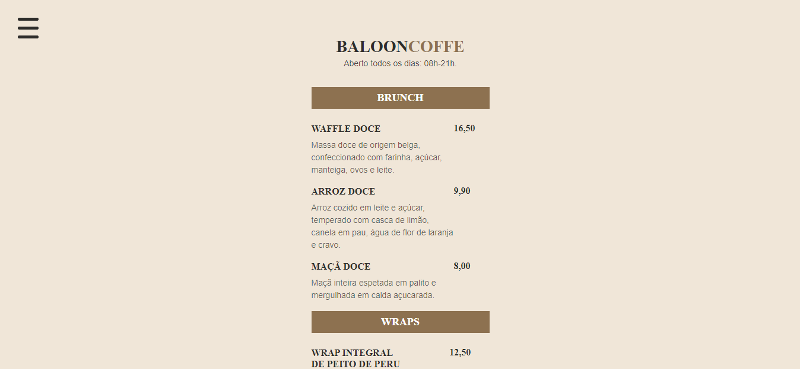

<h1 align="center"> Baloon Coffe </h1>

Cardápio digital.
 
Versão 1.0

  <a href="#-tecnologias">Tecnologias</a>&nbsp;&nbsp;&nbsp;|&nbsp;&nbsp;&nbsp;
  <a href="#-projeto">Projeto</a>&nbsp;&nbsp;&nbsp;&nbsp;&nbsp;&nbsp;

 

  

## 🚀 Tecnologias

Esse projeto foi desenvolvido com as seguintes tecnologias:

- HTML e CSS
- Git e Github

## 💻 Projeto

Cardápio digital da Baloon Coffe.

## 🖱️ Visite

https://balooncoffe.netlify.app/

---
👨‍💻 Desenvolvedor
 
- Jonatha Fernandes
